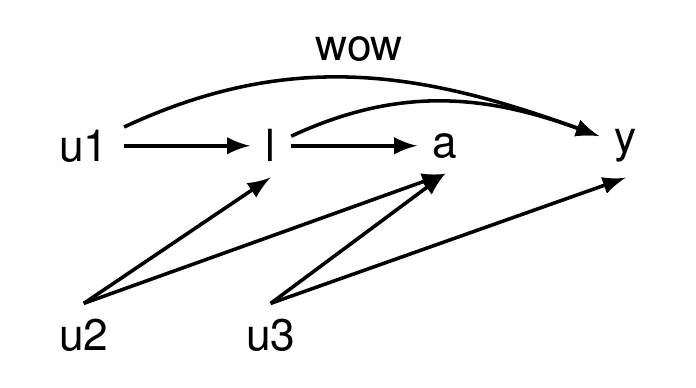

<!-- README.md is generated from README.Rmd. Please edit that file -->

# dagtex

The goal of dagtex is to …

## Installation

You can install the released version of dagtex from
[CRAN](https://CRAN.R-project.org) with:

``` r
install.packages("dagtex")
```

## Example

This is a basic example which shows you how to solve a common problem:

``` r
library(dagtex)

dagtex() %>% 
  add_node("x") %>% 
  add_node("y") %>% 
  add_edge("x", "y", is_curved = TRUE) %>%
  plot()
```


``` r

dagtex() %>% 
  add_node("u1") %>% 
  add_node("l") %>% 
  add_node("a") %>% 
  add_node("y") %>% 
  add_node("u2", below = 1) %>% 
  add_node("u3", below = 2) %>% 
  add_edge("u1", "l") %>% 
  add_edge("l", "a") %>% 
  add_edge("u1", "y", is_curved = TRUE, annotate = annotate_edge("wow")) %>% 
  add_edge("l", "y", is_curved = TRUE) %>%
  add_edge("u2", "l", start_position = "north", end_position = "south") %>% 
  add_edge("u2", "a", start_position = "north", end_position = "south") %>% 
  add_edge("u3", "a", start_position = "north", end_position = "south") %>% 
  add_edge("u3", "y", start_position = "north", end_position = "south") %>% 
  plot()
```


